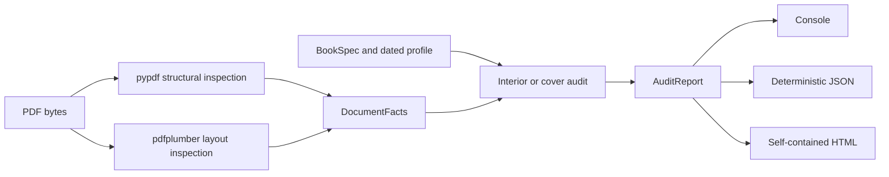

# Architecture

ProofMill separates evidence extraction from policy so PDF parser details do not leak into
the rule profile.

## Modules

| Module | Responsibility |
| --- | --- |
| `profiles.py` | trim parsing, KDP snapshot constants, margins, bleed, page ranges, spine math |
| `pdfinspect.py` | non-executing structural and layout evidence extraction |
| `audit.py` | pure issue decisions for an interior or cover |
| `models.py` | stable report schema, severity thresholds, aggregate status |
| `reports.py` | console, JSON, and offline HTML renderers |
| `config.py` | strict JSON project configuration and relative-path resolution |
| `cli.py` | argument parsing, exit codes, paired audit orchestration |

## Trust boundaries

PDF parsing is read-only. ProofMill does not:

- launch URLs or JavaScript;
- extract or open attachments;
- invoke a PDF viewer;
- overwrite source PDFs;
- send content to a service;
- include extracted manuscript words in reports.

The inspector uses two permissively licensed libraries for complementary evidence:

- `pypdf` for catalogs, page resources, font descriptors, name trees, and AcroForms;
- `pdfplumber` for placed images, word boxes, vectors, and top-down page coordinates.

The report includes the input SHA-256 so a reviewer can prove which export was checked.

## Determinism

Default reports have no wall-clock timestamp, absolute input path, random identifier, or
machine fingerprint. Keys and issues are sorted. The release gate generates two reports
from the same PDF in separate directories and requires a byte-for-byte match.

This is intentional: a CI artifact should change only when the input, configuration, rule
snapshot, or ProofMill version changes.

## Coordinate model

PDF uses points (`72 points = 1 inch`). `pdfplumber` reports `top` and `bottom` from the
top edge, which ProofMill uses consistently for text evidence.

For a bleed interior, KDP adds 0.125 inch to the outside edge and to both vertical edges.
The outside horizontal edge alternates with page parity. ProofMill derives:

1. the trim rectangle;
2. whether a page is left or right for the selected reading direction;
3. the page-count-dependent inside gutter;
4. the bleed-dependent outside margin;
5. a safe text rectangle.

A word triggers `TEXT_OUTSIDE_SAFE_AREA` if its bounding box crosses that rectangle by
more than 0.5 point. Reports store its box and a short SHA-256 prefix, not the word.

## Extending profiles

Profile work belongs behind a typed interface, not in conditional CLI output. A future
profile must own:

- source identity and snapshot date;
- trim and page-count constraints;
- bleed and margin math;
- cover and spine math;
- issue severity mapping;
- positive and negative synthetic fixtures.

The first release keeps one profile so users cannot accidentally select an unverified
printer approximation.

