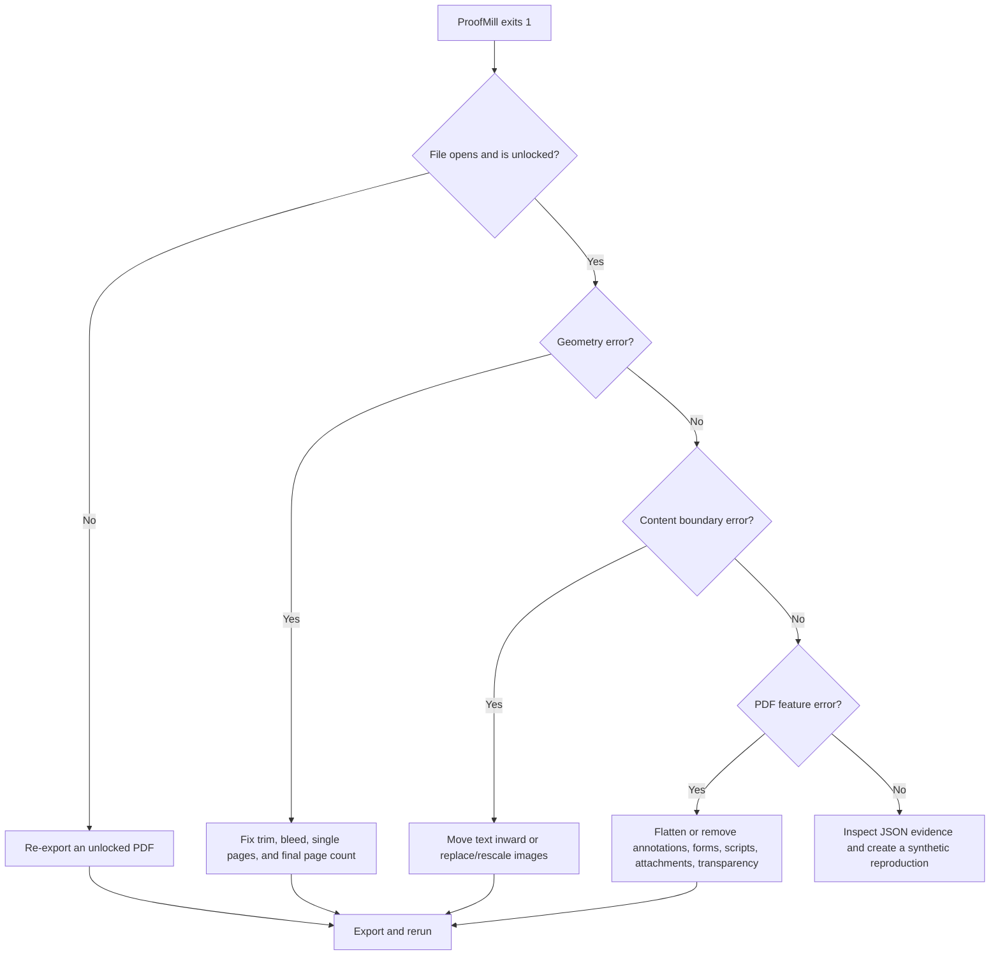

# Repair guide

Always repair the authoring source, export a fresh PDF, and rerun ProofMill on the exact
file intended for upload. Direct PDF surgery can change fonts, transparency, image
compression, boxes, and signatures in ways that create a second defect.

## Decision tree

## Geometry

### `PAGE_SIZE_MISMATCH`

1. Confirm the selected trim in the platform project.
2. For no bleed, set every interior page to the exact trim size.
3. For bleed, add 0.125 inch to width and 0.25 inch to height.
4. Extend intended bleed objects beyond the trim line.
5. Export single pages, not spreads.

The JSON evidence lists expected and actual point dimensions (`72 pt = 1 in`).

### `PAGE_SIZE_INCONSISTENT`

Find every distinct size in `sizes_points`. Common causes are a landscape insert, a cover
accidentally merged into the interior, or one imported page retaining Letter/A4 size.

### `COVER_SIZE_MISMATCH`

Finalize the interior first. Use the report's `effective_page_count` and
`spine_width_in`, regenerate the complete back-spine-front wrap, and export one page.
Changing one interior page can change the spine.

### `SPREAD_DETECTED`

Select "pages" rather than "spreads" in the layout application's PDF export. A print
interior requires one PDF page per physical page.

## Typography and safe areas

### `FONT_NOT_EMBEDDED`

Check the font's embedding permission and the export application's font settings. Replace
a restricted font rather than converting an entire book to outlines. After re-export,
use `proofmill rules` and the platform preview to verify glyphs.

### `TEXT_OUTSIDE_SAFE_AREA`

Open the reported page and use the evidence box to locate the item. The report intentionally
does not quote it. Check:

- mirrored inside/outside margins;
- italic glyph overhang;
- spaces or hidden characters at the end of a text box;
- running headers and page numbers;
- captions embedded as live PDF text over a bleed image.

### `SPINE_TEXT_NOT_ALLOWED` and `SPINE_TEXT_CLEARANCE`

Remove spine text at 79 pages or fewer. Above that threshold, keep every text box at least
0.0625 inch from both fold lines. Narrow spines often need a smaller type size or no text.

## Images and vectors

### `IMAGE_LOW_DPI`

The report gives source pixels, placed bounding box, and effective DPI. Replace the source
image or reduce its placed physical size. Changing only a metadata DPI tag does not create
pixels.

### `IMAGE_EXCESSIVE_DPI`

This is informational. Downsample only when file size, upload time, or processing failures
justify it. Keep the original asset outside the PDF.

### `THIN_LINE`

Increase table, chart, and decoration strokes to at least 0.75 point. Hairlines displayed
by an editor can disappear in manufacturing.

## Interactive and hidden PDF features

### `ANNOTATIONS_PRESENT`

Disable "include hyperlinks/comments" during print export. Flattening an annotation is not
the same as removing its PDF object; rerun ProofMill to confirm the annotation count is zero.

### `FORM_FIELDS_PRESENT`, `JAVASCRIPT_PRESENT`, `ATTACHMENTS_PRESENT`

Export a static print PDF from the source. Do not merely hide fields or scripts. These
features add no value to paper and increase parser ambiguity.

### `TRANSPARENCY_PRESENT`

Flatten transparent objects in the authoring source with a print-quality preset. Then
visually review gradients, shadows, blend modes, and small type at high zoom.

## Blank pages and page count

### `PAGE_COUNT_OUT_OF_RANGE`

Check the configured ink and paper. Standard color has a different minimum page count.
Do not pad a book with meaningless blank pages; choose a compatible production option.

### `ODD_PAGE_COUNT`

This is informational. Confirm the extra blank back side is acceptable and size the cover
using the even effective count.

### `EXCESSIVE_BLANK_PAGES`

Review every reported run. Intentional front matter is allowed, but accidental section
breaks can change spine math and reader experience.

## Suspected false positive

1. Preserve the original PDF locally.
2. Save `proofmill --version` and the redacted JSON report.
3. Recreate the same geometry with synthetic text and images.
4. Run `proofmill check` on the synthetic file.
5. Open a GitHub issue with the synthetic PDF and exact command.

Never attach an unpublished manuscript to a public issue.

